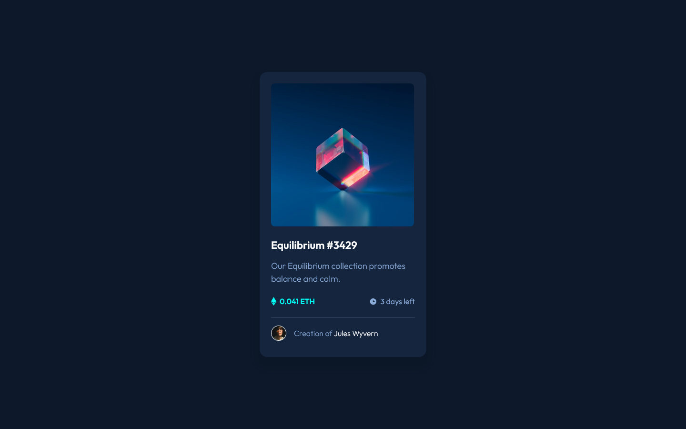
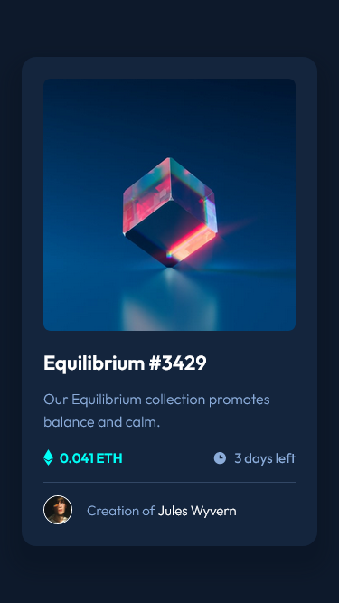

# Frontend Mentor - NFT preview card component solution

This is a solution to the [NFT preview card component challenge on Frontend Mentor](https://www.frontendmentor.io/challenges/nft-preview-card-component-SbdUL_w0U). Frontend Mentor challenges help you improve your coding skills by building realistic projects.

## Table of contents

- [Overview](#overview)
  - [The challenge](#the-challenge)
  - [Screenshots](#screenshots)
  - [Links](#links)
- [My process](#my-process)
  - [Built with](#built-with)
- [Author](#author)

## Overview

### The challenge

Users should be able to:

- View the optimal layout depending on their device's screen size
- See hover states for interactive elements

### Screenshots

### Links

- Live Site URL: [Github Pages](https://mehmeterogul.github.io/nft-preview-card-component/)

## My process

### Built with

- Mobile-first workflow
- Flexbox
- CSS custom properties

## Author

- Frontend Mentor - [@mehmeterogul](https://www.frontendmentor.io/profile/mehmeterogul)
- LinkedIn - [@mehmet-erogul](https://www.linkedin.com/in/mehmet-erogul)
- Twitter - [@MehmetErogul96](https://www.twitter.com/MehmetErogul96)
